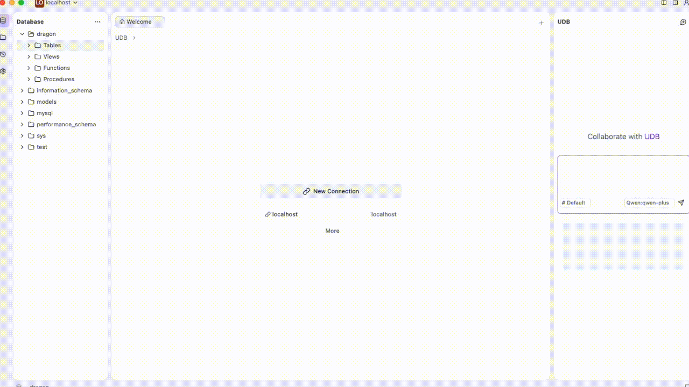
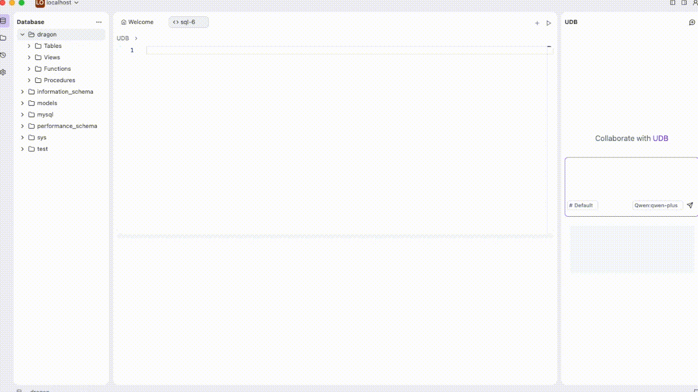

# UDB - Unified Database Management Tool
UDB, an open-source, multi-agent based modern database management tool.
## Introduction
UDB is a powerful database management tool built on Electron.js, Shadcn, and AI technologies. It supports multiple database types and offers unique features such as table structure generation and SQL writing based on large - language models.
### Screenshots
- UDB - Home Page

-  UDB - AI Create Table

-  UDB - AI Create SQL


## Features
1. **Multi - Database Support**: Connect and manage various databases, including but not limited to MySQL, PostgreSQL, SQLite, etc.
2. **AI - Powered Assistance**: Leverage the capabilities of large - language models to generate table structures and write SQL queries effortlessly.
3. **Modern UI**: Utilize Shadcn to provide a beautiful and intuitive user interface.
4. **Cross - Platform**: Thanks to Electron.js, UDB runs on Windows, macOS, and Linux.

## Installation
1. Clone the repository:
```bash
 git clone https://github.com/your - repo/udb-app.git
```
2. Navigate to the project directory:
```bash
cd udb - app
```
3. Install dependencies:
```bash
npm install
```

## Usage
1. Start the application:
```bash
npm start
```
2. Connect to your database by providing the necessary credentials.
3. Use the AI assistant to generate table structures or write SQL queries.

## Configuration
You can configure the application by modifying the `forge.config.ts` and `vite.*.config.*` files.

## Contributing
If you'd like to contribute to UDB, please follow these steps:
1. Fork the repository.
2. Create a new branch (`git checkout -b feature/your - feature`).
3. Commit your changes (`git commit -m 'Add some feature'`).
4. Push to the branch (`git push origin feature/your - feature`).
5. Open a pull request.

## Frequently Asked Questions
### Troubleshooting: GitHub Connection Timeout for `udb-java` Download
If you encounter a timeout issue when trying to download `udb-java` from GitHub, here are some possible solutions:

- **Check your network connection**: Ensure that your internet connection is stable and not blocked by a firewall or proxy.
- **Try a different network**: If possible, switch to a different Wi - Fi network or use your mobile data.
- **Use a mirror repository**: If available, try downloading `udb-java` from a mirror repository.
- **Retry at a different time**: Sometimes, GitHub may experience high traffic, causing connection issues. Try again later.

Alternatively, you can manually download the latest version of `udb-java` from the download address: [https://github.com/udb-org/udb-java/releases](https://github.com/udb-org/udb-java/releases), place it in the `.udb/server/jar` directory under your user directory, name it `udb-java.jar`,eg:`/Users/YourName/.udb/server/jar/udb-java.jar`, and then restart the application.
### Troubleshooting: JDK Download Failure
If you encounter issues downloading the JDK, you can manually download it from the following links based on your operating system:


- **Windows**: [openjdk-21.0.2_windows-x64_bin.zip](https://download.java.net/java/GA/jdk21.0.2/f2283984656d49d69e91c558476027ac/13/GPL/openjdk-21.0.2_windows-x64_bin.zip)
- **Mac/AArch64**: [openjdk-21.0.2_macos-aarch64_bin.tar.gz](https://download.java.net/java/GA/jdk21.0.2/f2283984656d49d69e91c558476027ac/13/GPL/openjdk-21.0.2_macos-aarch64_bin.tar.gz)
- **Mac/x64**: [openjdk-21.0.2_macos-x64_bin.tar.gz](https://download.java.net/java/GA/jdk21.0.2/f2283984656d49d69e91c558476027ac/13/GPL/openjdk-21.0.2_macos-x64_bin.tar.gz)
- **Linux/AArch64**: [openjdk-21.0.2_linux-aarch64_bin.tar.gz](https://download.java.net/java/GA/jdk21.0.2/f2283984656d49d69e91c558476027ac/13/GPL/openjdk-21.0.2_linux-aarch64_bin.tar.gz)
- **Linux/x64**: [openjdk-21.0.2_linux-x64_bin.tar.gz](https://download.java.net/java/GA/jdk21.0.2/f2283984656d49d69e91c558476027ac/13/GPL/openjdk-21.0.2_linux-x64_bin.tar.gz)

After downloading the appropriate JDK package, follow these steps:

1. **Extract the JDK**:
   - **For ZIP files (Windows)**: Right - click on the downloaded ZIP file and select "Extract All".
   - **For TAR.GZ files (Mac/Linux)**: Open a terminal, navigate to the directory where the file is downloaded, and run the command `tar -xzf <filename.tar.gz>`.

2. **Move the extracted JDK**: Move the extracted JDK directory to the `.udb/server/java` directory under your user directory. For example, on a Mac, it might be `/Users/YourName/.udb/server/java/jdk-21.0.2.jdk`.

3. **Restart the Application**: After completing the above steps, restart the UDB application for the changes to take effect.


## License
This project is licensed under the [LICENSE](LICENSE) file.

## Contact
If you have any questions or suggestions, feel free to contact us at your
